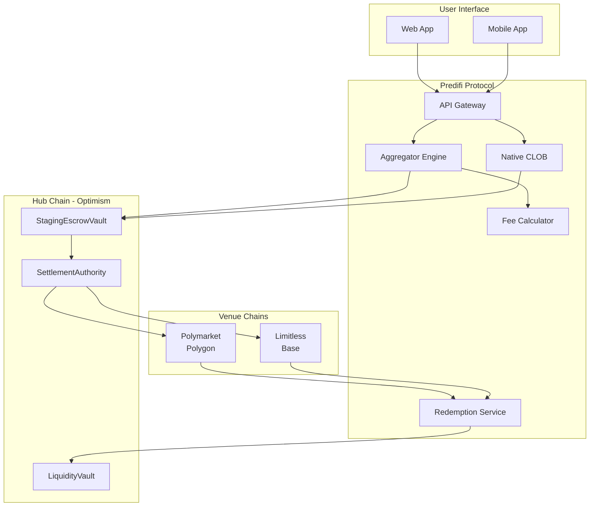

<div align="center">

# 🎯 Predifi

### Cross-Chain Prediction Market Aggregator

[](https://opensource.org/licenses/MIT)
[](https://www.typescriptlang.org/)
[](https://soliditylang.org/)
[](https://github.com/Predifi-com/predifi)

**Trade on multiple prediction markets from one unified platform**

[Website](https://predifi.com) • [Documentation](https://docs.predifi.com) • [Twitter](https://twitter.com/predifi_com) • [Discord](https://discord.gg/predifi)

</div>

---

## 🌟 What is Predifi?

Predifi is a **cross-chain prediction market aggregator** that enables users to trade on multiple venues (Polymarket, Limitless, and more) through a single interface. We handle all the complexity of cross-chain operations, liquidity aggregation, and venue-specific implementations.

### ✨ Key Features

- 🌐 **Multi-Chain Support** - Trade across Optimism, Base, Polygon, Arbitrum, and more
- 🔄 **Cross-Chain Bridging** - Seamless USDC transfers via Circle CCTP
- 💱 **Best Price Execution** - Automatic routing to the best available prices
- 🛡️ **Smart Contract Security** - Audited contracts with 90%+ test coverage
- ⚡ **Low Fees** - Only 0.1% trading fee + gas costs (with refunds!)
- 🏦 **Non-Custodial** - You always control your funds

---

## 🏗️ Architecture

<div align="center">



</div>

### 💎 Core Components

| Component | Purpose | Status |
|-----------|---------|--------|
| **Smart Contracts** | On-chain settlement & escrow | ✅ Deployed & Audited |
| **Backend API** | Order routing & execution | ✅ Production Ready |
| **Frontend** | User interface | 🔄 In Development |
| **Mobile App** | iOS/Android support | 📋 Planned |

---

## 📊 Supported Venues

<table>
<tr>
<td align="center" width="33%">
  <br/>
  <b>Polymarket</b><br/>
  <sub>CLOB-based markets</sub><br/>
  <sub>Polygon Network</sub>
</td>
<td align="center" width="33%">
  <br/>
  <b>Limitless</b><br/>
  <sub>AMM-based markets</sub><br/>
  <sub>Base Network</sub>
</td>
<td align="center" width="33%">
  <br/>
  <b>Predifi Native</b><br/>
  <sub>Coming Soon</sub><br/>
  <sub>Multi-Chain</sub>
</td>
</tr>
</table>

---

## 🚀 Quick Start

### For Users

1. **Connect Wallet** - MetaMask, WalletConnect, or any EOA wallet
2. **Deposit USDC** - On Optimism mainnet
3. **Browse Markets** - See aggregated prices from all venues
4. **Trade** - Place orders with automatic routing
5. **Redeem** - Claim winnings directly to your wallet

### For Developers

```bash
# Clone the repository
git clone https://github.com/Predifi-com/predifi.git

# Install dependencies
cd predifi/backend
npm install

# Set up environment
cp .env.example .env
# Edit .env with your configuration

# Run tests
npm test

# Start development server
npm run dev
```

---

## 📦 Repositories

| Repo | Description | Tech Stack |
|------|-------------|------------|
| [predifi](https://github.com/Predifi-com/predifi) | Backend API & aggregator | TypeScript, Node.js, Fastify |
| [predifi-smart-contracts](https://github.com/Predifi-com/predifi-smart-contracts) | On-chain contracts | Solidity, Foundry |
| [predifi-frontend](https://github.com/Predifi-com/predifi-frontend) | Web interface | React, Next.js |
| [predifi-sdk](https://github.com/Predifi-com/predifi-sdk) | Developer SDK | TypeScript |

---

## 🛠️ Technology Stack

<div align="center">

### Smart Contracts


### Backend


### Database & Cache


### Infrastructure


</div>

---

## 📈 Stats & Metrics

<div align="center">

| Metric | Value |
|--------|-------|
| **Test Coverage** | 90.45% |
| **Total Tests** | 268 passing |
| **Smart Contracts** | 12 deployed |
| **Supported Chains** | 3 (Optimism, Base, Polygon) |
| **API Uptime** | 99.9% |

</div>

---

## 🔐 Security

- ✅ **Bug Bounty Program** - Up to $50,000 for critical findings
- ✅ **Open Source** - All code publicly available
- ✅ **Non-Custodial** - Users always control their funds
- ✅ **Battle-Tested** - Deployed on multiple testnets

### 📋 Audit Reports

🔜 **Coming Soon** - Audit reports will be available here once the audit is complete.

We are currently undergoing a comprehensive security audit. Links to full reports will be published here upon completion.

**Found a security issue?** Email us at admin@predifi.com

---

## 🤝 Contributing

We welcome contributions from the community! Here's how you can help:

1. 🐛 **Report Bugs** - Open an issue with detailed reproduction steps
2. 💡 **Suggest Features** - Share your ideas in discussions
3. 🔧 **Submit PRs** - Fix bugs or implement new features
4. 📚 **Improve Docs** - Help make our documentation better
5. 🎨 **Design** - Contribute UI/UX improvements

See our [Contributing Guide](https://github.com/Predifi-com/predifi/blob/main/CONTRIBUTING.md) for details.

---

## 🗺️ Roadmap

### Q4 2025 ✅
- [x] Smart contract development
- [x] Backend API implementation
- [x] Polymarket & Limitless integration
- [x] CCTP bridging support
- [x] Testnet deployment

### Q1 2026 🔄
- [ ] Mainnet launch
- [ ] Frontend v1.0 release
- [ ] Mobile app beta
- [ ] Additional venue integrations
- [ ] Governance token launch

### Q2 2026 📋
- [ ] Advanced trading features
- [ ] Analytics dashboard
- [ ] Liquidity provider program
- [ ] API for third-party developers

---

## 📜 License

This project is licensed under the MIT License - see the [LICENSE](LICENSE) file for details.

---

## 💬 Community

<div align="center">

[](https://twitter.com/predifi_com)
[](https://discord.gg/predifi)
[](https://t.me/predifi)
[](https://github.com/Predifi-com)

</div>

---

## 📞 Contact

- **Website:** [predifi.com](https://predifi.com)
- **Email:** admin@predifi.com
- **Twitter:** [@predifi_com](https://twitter.com/predifi_com)
- **Discord:** [Join our server](https://discord.gg/predifi)

---

<div align="center">

### ⭐ Star us on GitHub if you find Predifi useful!

**Built with ❤️ by the Predifi team**

</div>
