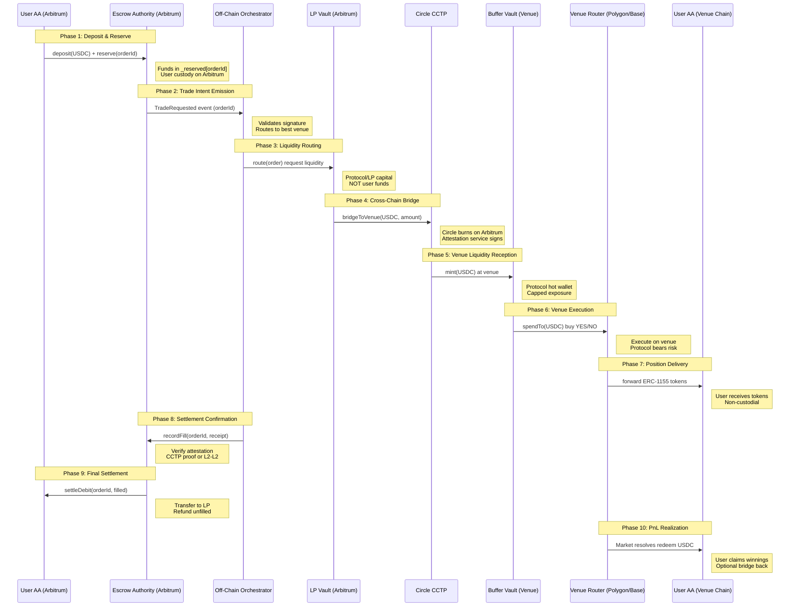

# Predifi Trade Execution & Fund Flow Diagram

## Overview

This document illustrates the complete lifecycle of a trade on Predifi, showing how funds and positions move across chains while maintaining user custody and minimizing cross-chain exposure.

---

## Trade Execution Flow

---

## Custody & Risk (who holds what, when)

| Phase | User USDC custody | Position tokens custody | Funds leave Arbitrum? | Execution/settlement risk |
|-------|-------------------|--------------------------|-----------------------|----------------------------|
| **Deposit** | User AA or `StagingEscrowVault._available` | — | ❌ No (user funds remain on Arbitrum) | ✅ None – user retains full custody |
| **Reserve** | `StagingEscrowVault._reserved[orderId]` | — | ❌ No (user funds locked but on Arbitrum) | ✅ None – reversible via cancelFromIntent before expiry |
| **Execute (external)** | Still `_reserved` on Arbitrum (untouched) | User AA on venue (tokens forwarded after buy) | ⚠️ Protocol capital only (LP→BufferVault via CCTP) | ⚠️ Protocol/LP bears slippage & operational risk within BufferVault caps |
| **RecordFill** | Deduct filled notional to LP/settlement | Already with user on venue (or gated until confirmation) | ❌ No (user funds stay on Arbitrum) | ✅ None for user – two-phase commit ensures atomicity |
| **Settle** | User redeems on venue (USDC) or native pays on Arbitrum | User AA holds position tokens on venue | 🔄 Optional (user-initiated bridge back to Arbitrum if desired) | 🎲 Market outcome risk = **user**; hedge/execution risk = **protocol** (BufferVault caps limit exposure) |

---

## Summary Notes

### ✅ When do user funds leave Arbitrum?

**Never.** User USDC remains in `StagingEscrowVault` on Arbitrum throughout the entire trade lifecycle. Only **protocol/LP liquidity** moves cross-chain via CCTP to execute trades on behalf of users.

- **User deposit** → Arbitrum escrow (`_available`)
- **Intent reserve** → Arbitrum escrow (`_reserved[orderId]`)
- **Trade execution** → Protocol's BufferVault (venue chain) uses LP capital
- **Settlement** → User's reserved funds deducted on Arbitrum, sent to LP

User **never** needs to bridge funds themselves unless they choose to withdraw winnings from venue back to Arbitrum.

---

### 🛡️ Who bears what risk?

| Risk Type | Bearer | Mitigation |
|-----------|--------|------------|
| **Market outcome risk** (YES/NO tokens gain/lose value) | 🎯 **User** | Standard prediction market risk – user's trading decision |
| **Execution risk** (slippage, failed venue tx, BufferVault loss) | 🏦 **Protocol/LP** | BufferVault caps (`_tokenCaps[USDC]`), hot wallet limits, automated rebalancing |
| **Cross-chain bridge risk** (CCTP failure, attestation delay) | 🏦 **Protocol/LP** | Circle's trust-minimized CCTP, 15-minute finality, fallback bridges (ViaLabs) |
| **Venue settlement risk** (Polymarket/Limitless fails to deliver tokens) | 🏦 **Protocol + User** | Protocol absorbs if venue fails pre-delivery; user if post-delivery (standard venue risk) |
| **Smart contract risk** (bugs, exploits in escrow/vault logic) | 🏦 **Protocol + User** | Comprehensive test coverage (90%+), ongoing audits, pausable contracts, role-based access control |

---

### 🔐 Key Security Properties

1. **Non-Custodial for Users** – Funds stay in user-controlled escrow on Arbitrum until settlement confirmation
2. **Two-Phase Commit** – Atomic reservation → execution → settlement with revert capability
3. **Replay Protection** – EIP-712 signed intents with nonce tracking prevent double-spend
4. **Expiry Guards** – All intents have deadlines; users can cancel if execution stalls
5. **Capped Exposure** – BufferVault limits (`_tokenCaps`) prevent runaway protocol losses
6. **Cross-Chain Attestation** – CCTP proofs or L2-L2 messenger ensure fill legitimacy before settlement

---

### 📊 Capital Efficiency

- **User capital** never leaves Arbitrum (no bridging costs, no cross-chain exposure)
- **Protocol capital** (LP funds) bridges on-demand to venue BufferVaults for execution
- **Rebalancing flows** (V2): Settled funds can be pushed back from escrow → LPVault via CCTP for continuous liquidity cycling

---

**Document Version:** 1.0  
**Last Updated:** November 24, 2025  
**Maintained by:** Predifi Engineering Team
