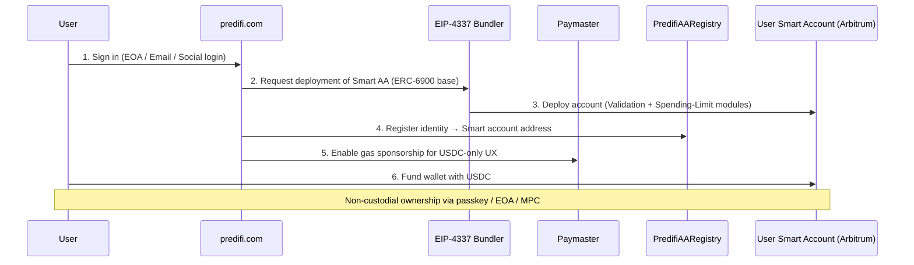
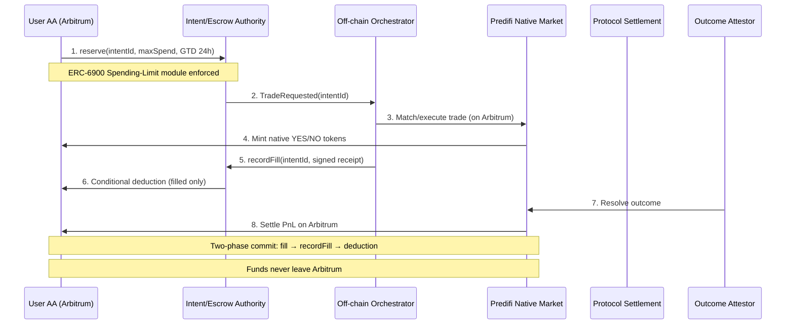
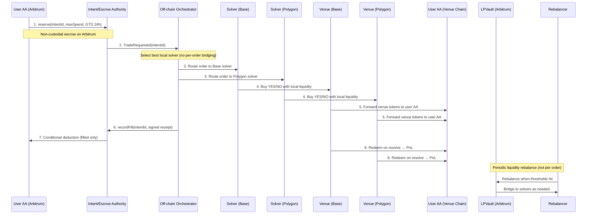

# Predifi — Onboarding, Native Trade, and Venue Trade Flows
(EIP-4337 + ERC-6900 Smart Accounts)

---

## 1️⃣ User Onboarding Flow

This diagram shows how a new user signs up on predifi.com and receives a non-custodial Smart AA Wallet using EIP-4337 and ERC-6900.



**Key Features:**
- **ERC-6900 modular architecture** – Validation + Spending-Limit modules installed at deployment
- **EIP-4337 account abstraction** – Bundler handles UserOperation submission
- **Gas sponsorship** – Optional paymaster for seamless USDC-only UX
- **Non-custodial** – User retains full control via passkey, EOA, or MPC

---

## 2️⃣ Native Prediction Market Trade Flow

This diagram shows how a user trades on a native Arbitrum market and receives Predifi YES/NO tokens.



**Key Architecture:**
- **Two-phase commit protocol** – Reserve → Execute → RecordFill → Deduct (atomic settlement)
- **GTD (Good-Til-Day) 24h** – Orders expire after 24 hours with auto-release of unfilled amounts
- **Native execution** – All operations occur on Arbitrum (no cross-chain bridging)
- **Conditional deduction** – User funds deducted only after fill confirmation

---

## 3️⃣ External Venue Trade Flow (Polymarket / Limitless)

This diagram shows how a user trades via external venues through protocol-owned solvers (BufferVaults). The user receives venue-native YES/NO tokens.



**Key Architecture:**
- **BufferVaults = protocol-owned solvers** – Pre-funded hot wallets on each venue chain
- **No per-intent bridging** – Solvers use local liquidity, eliminating cross-chain latency per order
- **CCTP periodic rebalance only** – Batch bridging when solver balances hit thresholds (< 10% or > 90% cap)
- **GTD 24h lifecycle** – Partial fills aggregate; unfilled amounts auto-release after expiry
- **User funds never leave Arbitrum** – Only protocol/LP capital bridges to venue chains

---

## 📊 Custody & Risk Table

| Phase | User USDC custody | Position tokens custody | Funds leave Arbitrum? | Execution / settlement risk |
|-------|-------------------|--------------------------|-----------------------|------------------------------|
| **Deposit** | User AA or `StagingEscrowVault._available` | — | ❌ **No** (user funds) | ✅ None – user retains full custody |
| **Reserve** | `StagingEscrowVault._reserved[orderId]` | — | ❌ **No** (user funds) | ✅ None – reversible via cancel before expiry |
| **Execute (Native)** | Still `_reserved` on Arbitrum | Native YES/NO in User AA (Arb) | ❌ **No** | ✅ None for user |
| **Execute (Venue Solver)** | Still `_reserved` on Arbitrum (untouched) | Venue YES/NO in User AA (venue chain) | ❌ **No per order** – solver uses local liquidity | ⚠️ **Protocol/Solver** bears slippage & operational risk within BufferVault caps |
| **RecordFill** | Deduct filled only to LP/settlement | Already with user (or gated until confirmation) | ❌ **No** (user funds) | ✅ None for user – two-phase commit ensures atomicity |
| **Settle** | User redeems (venue) / native pays (Arb) | User AA holds position tokens | 🔄 **Optional** (user-initiated bridge back if desired) | 🎲 Market outcome = **user**; hedge/ops = **protocol** (bounded by caps) |
| **Rebalance (periodic)** | — | — | ✅ **Yes** (protocol liquidity only) via CCTP thresholds | ⚠️ Protocol treasury (bounded by `_tokenCaps`) |

---

## 📝 Summary Notes

### 🔐 ERC-6900 + EIP-4337 Smart Accounts

- **Validation module** – Enforces EIP-712 signed intents with nonce protection
- **Spending-Limit module** – User-configurable caps per intent/daily limits
- **Session Keys (optional)** – Approve orchestrator for GTD orders without repeated signing
- **Non-custodial** – User retains ultimate control, can revoke anytime

### 🔒 Two-Phase Commit Protocol

Ensures deterministic reconciliation even with asynchronous cross-chain execution:

1. **Phase 1: Reserve** – User funds locked in `_reserved[orderId]` on Arbitrum
2. **Phase 2: Execute** – Solver executes trade on venue using local liquidity
3. **Phase 3: Attestation** – Venue confirms fill with signed receipt
4. **Phase 4: Deduction** – Authority deducts filled amount only after verification

**Rollback capability:** If execution fails, user funds released from reservation (no loss).

### ⏰ GTD (Good-Til-Day) 24h Lifecycle

- **Partial fills aggregate** – Multiple venue executions combine toward total intent
- **Unfilled auto-release** – After 24h, unreserved funds return to `_available`
- **No forced execution** – User can cancel anytime before fills complete
- **Nonce protection** – EIP-712 signed intents prevent replay attacks

### 🚫 No Per-Order Bridging

**Traditional cross-chain trading problem:**
- Every order requires: Lock funds → Bridge → Execute → Bridge back = 30+ minutes per trade
- High latency, poor UX, expensive gas

**Predifi's solver architecture solution:**
- BufferVaults (solvers) pre-funded on each venue chain with protocol/LP capital
- Orders execute immediately using local solver liquidity
- User funds **never leave Arbitrum** – only protocol capital at risk
- **CCTP rebalancing happens periodically** – Batch operations when thresholds hit:
  - Low threshold: BufferVault balance < 10% of cap
  - High threshold: BufferVault balance > 90% of cap (return excess to LPVault)
  - Time-based: Every 24h regardless of balance (reconciliation sweep)

### 🏛️ Regulated Venues (Kalshi Integration)

**KYC-gated access for compliant markets:**
- Kalshi requires CFTC-regulated KYC for US users
- **Protocol-level KYC verification** before routing to Kalshi
- Non-KYC users automatically restricted to non-regulated venues (Polymarket, Limitless)
- Venue routing logic enforces compliance at orchestrator level

**Compliance flow:**
```
User submits KYC (off-chain) → 
Protocol verifies identity → 
Whitelist address in SettlementAuthority → 
Orchestrator enables Kalshi routing for verified users only
```

### 🎯 Risk Partition Model

| Risk Type | Bearer | Mitigation |
|-----------|--------|------------|
| **Market outcome risk** (YES/NO price movements) | 🎯 **User** | Standard prediction market risk – user's trading decision |
| **Execution risk** (slippage, failed venue tx) | 🏦 **Protocol/Solver** | BufferVault caps (`_tokenCaps[USDC]`), hot wallet limits per venue |
| **Liquidity risk** (solver runs dry) | 🏦 **Protocol/LP** | Automated CCTP rebalancing triggers when thresholds reached |
| **Bridge risk** (CCTP failure during rebalance) | 🏦 **Protocol treasury** | Circle's trust-minimized CCTP, 15-minute finality, fallback monitoring |
| **Venue settlement risk** (Polymarket/Limitless fails) | 🏦 **Protocol + User** | Protocol absorbs pre-delivery failures; user post-delivery (standard venue risk) |
| **Smart contract risk** (bugs, exploits) | 🏦 **Protocol + User** | 90%+ test coverage, ongoing audits, pausable contracts, role-based access control |

---

**Document Version:** 1.0  
**Last Updated:** November 24, 2025  
**Maintained by:** Predifi Engineering Team

